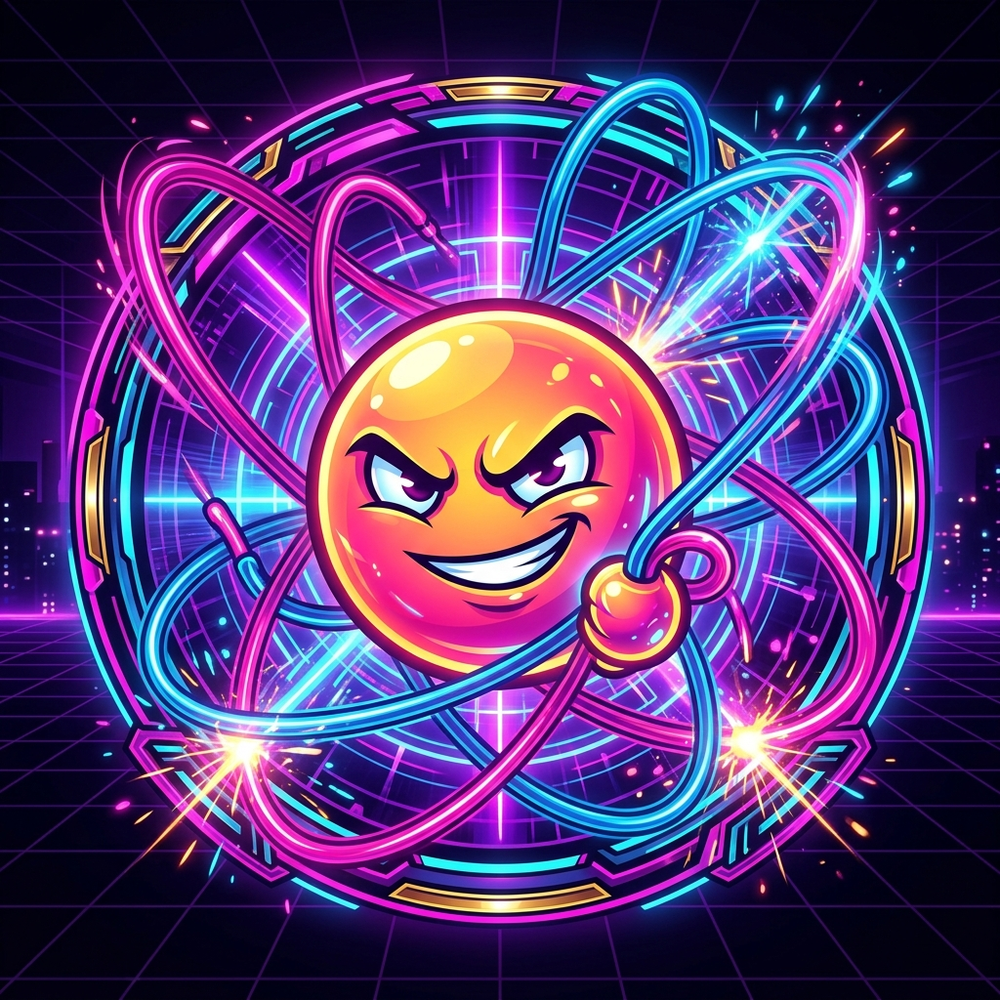

# 🌌 Neon Tether Showdown



A premium, fast-paced, retro-futuristic arcade battle game built with vanilla HTML5, Canvas, and CSS. Players compete in a neon-drenched circular arena, scoring bounces off their paddles, clashing with opponent tethers to steal points, and dodging elimination as their tethers snap and scale dynamically.

---

## 🎮 Live Game Links

*   **Production Deployment:** [https://ballbouncerbattle.vercel.app](https://ballbouncerbattle.vercel.app)
*   **Alternate Domain:** [https://ballbouncerbattel.vercel.app](https://ballbouncerbattel.vercel.app)
*   **GitHub Repository:** [tayyabsul3/neon-tether-showdown](https://github.com/tayyabsul3/neon-tether-showdown)

---

## ✨ Features

### 1. Retro-Futuristic Cyberpunk Theme
*   **Colors:** Styled with deep cosmic space backdrop (`#0c0b1e`), neon violet (`#7C3AED`), lavender (`#A78BFA`), and hot pink action indicators (`#F43F5E`).
*   **Aesthetics:** Glowing text shadows for scores resembling neon light tubes, combined with a nostalgic CRT scanline overlay grid.
*   **Fonts:** Styled with bold typography utilizing Google Fonts' *Russo One* (game header font) and *Chakra Petch* (monospaced cyber body text).

### 2. Progressive Web App (PWA)
*   **Installed App:** Configure web settings to install **Neon Tether Showdown** as a standalone app directly to your Android or iOS homescreen.
*   **Offline Capabilities:** Service workers intercept and cache static scripts, stylesheets, fonts, and inline SVG assets, allowing the game to load instantly and run fully offline.
*   **Vector Icon/Favicon:** Includes a sharp vector `icon.svg` as the web browser favicon and installed app launcher icon.

### 3. Canvas Vector Rendering & Interactive Expressions
*   Bouncers draw detailed canvas vector paths instead of text emojis.
*   Face structures (eyes, pupil sizes, smiles, and frowns) change dynamically based on bouncer combat status:
    *   `happy`: Default smile when gliding.
    *   `shocked`: Wide eyes and mouth on wall bounces.
    *   `dizzy`: Rotated X eyes on ball-on-ball collisions.
    *   `cheeky`: Smirking mouth and aligned pupils when stealing points.
    *   `pain`: Frowning mouth and pupils looking up-right when points/tethers are stolen.

### 4. Watertight Tether & Score System
*   A strict 1-to-1 score-to-tether ratio.
*   Balls steal tethers on touch, shifting line connections and points dynamically.
*   Players start with exactly `1` point and `1` starting line.

### 5. Final Duel Pacing (Matches end in <1 minute)
*   When only **2 players remain**, the final showdown is accelerated:
    *   **Dynamic Paddle Shrinking:** Paddles dynamically and visually shrink from `0.30` down to `0.10` radians over 25 seconds of combat, making blocks extremely difficult.
    *   **Double Speedup:** Speed boosts trigger every **5 seconds** instead of 10 seconds, scaling velocities rapidly.

### 6. Interactive Win Overlays & Confetti Particle System
*   Spawns `120` colorful confetti strips that fall, float, and rotate across the screen on victory.
*   Includes a dedicated win screen overlay modal featuring the winning bouncer's SVG avatar and a primary "Play Again" rematch button.

---

## 📁 File Structure

```text
├── index.html       # Game view, start screen selectors, and winner modals
├── game.js          # Core math physics vectors, audio synthesis, and confetti loop
├── style.css        # Cyberpunk design system styles, CRT overlays, and neon glows
├── icon.svg         # SVG favicon and PWA app icon
├── logo.png         # Official high-resolution game logo
├── manifest.json    # PWA configuration specifications
├── sw.js            # Service worker cache configuration (offline support)
└── README.md        # Documentation and releases
```

---

## 🚀 How to Run Locally

Since this is a fully client-side game, you can run it without any heavy build steps:

1.  Clone the repository:
    ```bash
    git clone https://github.com/tayyabsul3/neon-tether-showdown.git
    cd neon-tether-showdown
    ```
2.  Open `index.html` directly in any web browser, or serve it using a lightweight local web server:
    ```bash
    npx vercel dev
    # or
    python -m http.server 8000
    ```
3.  Navigate to `http://localhost:8000` (or the local server address) in your browser.
